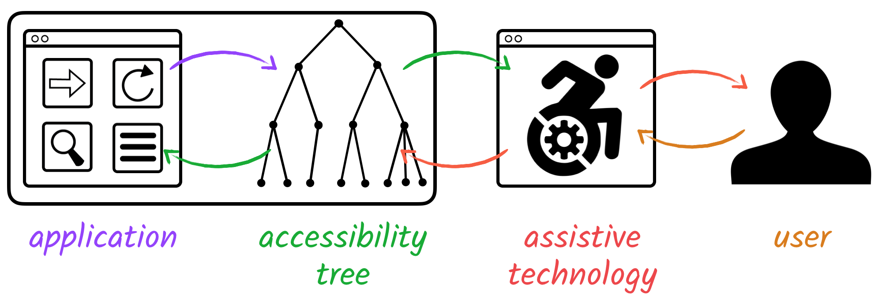
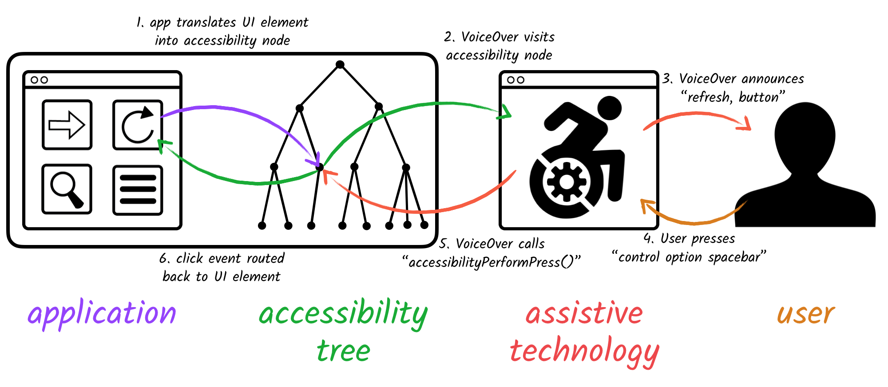
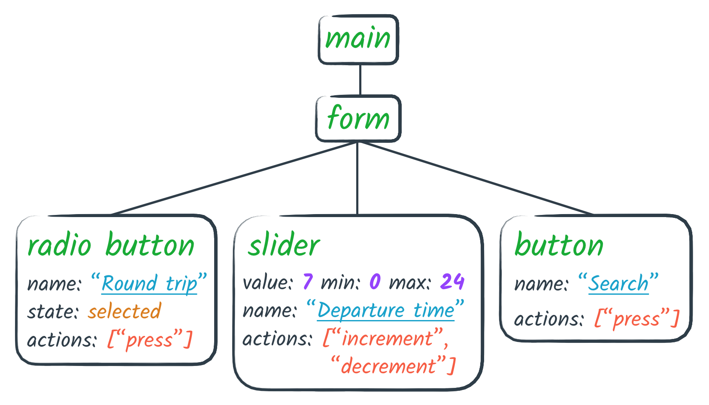
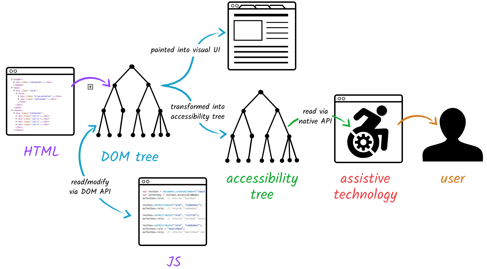
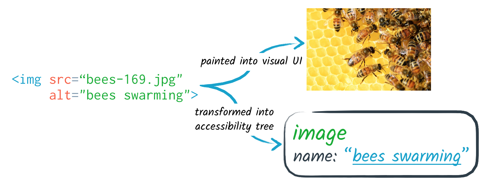

# Accessibility Object Model

**Authors:**

* Alice Boxhall, Google, aboxhall@google.com
* James Craig, Apple, jcraig@apple.com
* Dominic Mazzoni, Google, dmazzoni@google.com
* Alexander Surkov, Mozilla, surkov.alexander@gmail.com

<!-- START doctoc generated TOC please keep comment here to allow auto update -->
<!-- DON'T EDIT THIS SECTION, INSTEAD RE-RUN doctoc TO UPDATE -->
**Table of Contents**

- [Introduction](#introduction)
- [Background: assistive technology and the accessibility tree](#background-assistive-technology-and-the-accessibility-tree)
  - [Accessibility node properties](#accessibility-node-properties)
- [DOM tree, accessibility tree and platform accessibility APIs](#dom-tree-accessibility-tree-and-platform-accessibility-apis)
  - [Mapping native HTML to the accessibility tree](#mapping-native-html-to-the-accessibility-tree)
  - [ARIA](#aria)
- [Gaps in the web platform's accessibility story](#gaps-in-the-web-platforms-accessibility-story)
- [The Accessibility Object Model](#the-accessibility-object-model)
  - [Phase 1: Accessible Properties](#phase-1-accessible-properties)
  - [Phase 2: Accessible Actions](#phase-2-accessible-actions)
  - [Phase 3: Virtual Accessibility Nodes](#phase-3-virtual-accessibility-nodes)
  - [Phase 4: Computed Accessibility Tree](#phase-4-computed-accessibility-tree)
  - [Phases: Summary](#phases-summary)
  - [Audience for the proposed API](#audience-for-the-proposed-api)
- [Next Steps](#next-steps)
  - [Incubation](#incubation)
- [Additional thanks](#additional-thanks)
- [Appendix: `accessibleNode` naming](#appendix-accessiblenode-naming)

<!-- END doctoc generated TOC please keep comment here to allow auto update -->

## Introduction

This effort aims to create a JavaScript API
to allow developers to modify (and eventually explore) the accessibility tree
for an HTML page.

## Background: assistive technology and the accessibility tree

Assistive technology, in this context, refers to a third party application
which augments or replaces the existing UI for an application.
One well-known example is a screen reader,
which replaces the visual UI and pointer-based UI
with an auditory output (speech and tones)
and a keyboard and/or gesture-based input mechanism.

Many assistive technologies interact with a web page via accessibility APIs, such as
[UIAutomation](https://msdn.microsoft.com/en-us/library/windows/desktop/ee684009.aspx)
on Windows, or
[NSAccessibility](https://developer.apple.com/library/mac/documentation/AppKit/Reference/NSAccessibility_Protocol_Reference/)
on OS X.
These APIs allow an application to expose a tree of objects representing the application's interface,
typically with the root node representing the application window,
with various levels of grouping node descendants down to individual interactive elements.
This is referred to as the **accessibility tree**.

An assistive technology user interacts with the application almost exclusively via this API,
as the assistive technology uses it both to create the alternative interface,
and to route user interaction events triggered by the user's commands to the assistive technology.



Both the alternative interface's *output*
(e.g. speech and tones,
updating a [braille display](https://en.wikipedia.org/wiki/Refreshable_braille_display),
moving a [screen magnifier's](https://en.wikipedia.org/wiki/Screen_magnifier) focus)
and *input*
(e.g. keyboard shortcuts, gestures, braille routing keys,
[switch devices](https://en.wikipedia.org/wiki/Switch_access), voice input)
are completely the responsibility of the assistive technology,
and are abstracted away from the application.

For example, a [VoiceOver](https://www.apple.com/voiceover/info/guide/) user
interacting with a native application on OS X
might press the key combination
"Control Option Spacebar" to indicate that they wish to click the UI element which the screen reader is currently visiting.



These keypresses would never be passed to the application,
but would be interpreted by the screen reader,
which would then call the
[`accessibilityPerformPress()`](https://developer.apple.com/reference/appkit/nsaccessibilitybutton/1525542-accessibilityperformpress?language=objc)
function on the accessibility node representing the UI element in question.
The application can then handle the press action;
typically, this routes to the code which would handle a click event.

Accessibility APIs are also popular for testing and automation.
They provide a way to examine an application's state and manipulate its UI from out-of-process,
in a robust and comprehensive way.
While assistive technology for users with disabilities
is typically the primary motivator for accessibility APIs,
it's important to understand that these APIs are quite general
and have many other uses.

### Accessibility node properties

Each node in the accessibility tree may be referred to as an **accessibility node**.
An accessibility node always has a **role**, indicating its semantic purpose.
This may be a grouping role,
indicating that this node merely exists to contain and group other nodes,
or it may be an interactive role,
such as `"button"`.



The user, via assistive technology, may explore the accessibility tree at various levels.
They may interact with grouping nodes,
such as a landmark element which helps a user navigate sections of the page,
or they may interact with interactive nodes,
such as a button.
In both of these cases,
the node will usually need to have a **label** (often referred to as a **name**)
to indicate the node's purpose in context.
For example, a button may have a label of "Ok" or "Menu".

Accessibility nodes may also have other properties,
such as the current **value**
(e.g. `"10"` for a range, or `"Jane"` for a text input),
or **state** information
(e.g. `"checked"` for a checkbox, or `"focused"`).

Interactive accessibility nodes may also have certain **actions** which may be performed on them.
For example, a button may expose a `"press"` action, and a slider may expose
`"increment"` and `"decrement"` actions.

These properties and actions are referred to as the *semantics* of a node.
Each accessibility API expresses these concepts slightly differently,
but they are all conceptually similar.

##  DOM tree, accessibility tree and platform accessibility APIs

The web has rich support for making applications accessible,
but only via a *declarative* API.

The DOM tree is translated, in parallel,
into the primary, visual representation of the page,
and the accessibility tree,
which is in turn accessed via one or more *platform-specific* accessibility APIs.



Some browsers support multiple accessibility APIs across different platforms,
while others are specific to one accessibility API.
However, any browser that supports at least one native accessibility API
has some mechanism for exposing a tree structure of semantic information.
We refer to that mechanism, regardless of implementation details,
as the **accessibility tree** for the purposes of this API.

### Mapping native HTML to the accessibility tree

Native HTML elements are implicitly mapped to accessibility APIs.
For example, an  `` element will automatically be mapped
to an accessibility node with a role of `"image"`
and a label based on the `alt` attribute (if present).




### ARIA

Alternatively, [ARIA](https://www.w3.org/TR/wai-aria-1.1/)
allows developers to annotate elements with attributes to override
the default role and semantic properties of an element -
but not to expose any accessible actions.


In either case there's a one-to-one correspondence
between a DOM node and a node in the accessibility tree,
and there is minimal fine-grained control over the semantics of the corresponding accessibility node.

## Gaps in the web platform's accessibility story

Web apps that push the boundaries of what's possible on the web struggle to make them accessible
because the APIs aren't yet sufficient -
in particular, they are much less expressive than the native APIs that the browser communicates with.

## The Accessibility Object Model

This spec proposes the *Accessibility Object Model*.
We plan to split this work into four phases,
which will respectively allow authors to:

1. modify the semantic properties of the accessibility node associated with a particular DOM node,
3. directly respond to events (or actions) from assistive technology,
3. create virtual accessibility nodes which are not directly associated with a DOM node, and
4. programmatically explore the accessibility tree
   and access the computed properties of accessibility nodes.

In the following sections we'll outline each of these phases.

### Phase 1: Accessible Properties


This phase will explain and augment the existing capabilities of
[ARIA](https://www.w3.org/TR/wai-aria-1.1/).

Using ARIA, it's possible to override and add to the default semantic values for an element:

```html
<div role="checkbox" aria-checked="true">Receive promotional offers</div>
```

In this example,
the [default role of a `<div>`](https://www.w3.org/TR/html-aam-1.0/#el-div),
which would usually be assigned a grouping role or excluded from the accessibility tree,
is overridden to give the accessibility node associated with this element
a role of `checkbox`.

Furthermore, the
[default value of the accessible `checked` property](https://www.w3.org/TR/wai-aria/states_and_properties#aria-checked)
is overridden to expose the element as a "checked checkbox".

**The first phase of AOM, *Accessible Properties*,
would create a different mechanism to achieve the same result:**

```js
el.accessibleNode.role = "checkbox";  // (See link below for naming concerns)
el.accessibleNode.checked = "true";
```

(There are some [notes on `accessibleNode` naming](#appendix-accessiblenode-naming).)


#### Use cases for Accessible Properties

Accessible Properties would avoid Custom Elements needing to "sprout" attributes in order to express their own semantics.

Today, a library author creating a custom element is forced to "sprout" ARIA attributes
to express semantics which are implicit for native elements.

```html
<!-- Page author uses the custom element as they would a native element -->
<custom-slider min="0" max="5" value="3"></custom-slider>

<!-- Custom element is forced to "sprout" extra attributes to express semantics -->
<custom-slider min="0" max="5" value="3" role="slider"
               tabindex="0" aria-valuemin="0" aria-valuemax="5"
               aria-valuenow="3" aria-valuetext="3"></custom-slider>
```

Using AOM, a Custom Element author would be able to write a class declaration like this:

```js
class CustomCheckbox extends HTMLElement {
  constructor() {
    super();

    // Apply a role of "checkbox" via the AOM
    this.accessibleNode.role = "checkbox";
  }

  // Observe the custom "checked" attribute
  static get observedAttributes() { return ["checked"]; }

  // When the custom "checked" attribute changes,
  // keep the accessible checked state in sync.
  attributeChangedCallback(name, old, newValue) {
    switch(name) {
    case "checked":
      this.accessibleNode.checked = (newValue !== null);
    }
  }

  connectedCallback() {
    // When the custom checkbox is inserted in the page,
    // ensure the checked state is in sync with the checked attribute.
    this.accessibleNode.checked = this.hasAttribute("checked");
  }
}

customElements.define("x-checkbox", CustomCheckbox);
```

```html
<custom-checkbox checked>Receive promotional offers</custom-checkbox>
```

Furthermore, writing Accessible Properties would allow specifying accessible relationships without requiring IDREFs,
as authors can now pass DOM object references:

```js
el.accessibleNode.describedBy = [el1, el2, el3];
el.accessibleNode.activeDescendant = el2;
```

Moreover, writing Accessible Properties would enable authors using Shadow DOM
to specify relationships which cross over Shadow DOM boundaries.

Today, an author attempting to express a relationship across Shadow DOM boundaries
might attempt using `aria-activedescendant` like this:
```html
<custom-combobox>
  #shadow-root
  |  <!-- this doesn't work! -->
  |  <input aria-activedescendant="opt1"></input>
  |  <slot></slot>
  <custom-optionlist>
    <x-option id="opt1">Option 1</x-option>
    <x-option id="opt2">Option 2</x-option>
    <x-option id='opt3'>Option 3</x-option>
 </custom-optionlist>
</custom-combobox>
```

This fails, because IDREFs are scoped within the shadowRoot
or document context in which they appear.

Using Accessible Properties,
an author could specify this relationship programmatically instead:

```js
const input = comboBox.shadowRoot.querySelector("input");
const optionList = comboBox.querySelector("custom-optionlist");
input.accessibleNode.activeDescendant = optionList;
```

This would allow the relationship to be expressed naturally.

**Accessible properties and reflection**

The element's `accessibleNode` property would reflect attributes set via ARIA:

```html
<div id="foo" role="button"></div>
```

```js
console.log(document.getElementById("foo").accessibleNode.role);  // "button"
```

However, it would *not* reflect back to ARIA attributes:

```js
document.getElementById("foo").accessibleNode.role = "checkbox";
document.getElementById("foo").getAttribute("role");  // Still returns "button"
```

### Phase 2: Accessible Actions

**Accessible Actions** will allow authors to react to events coming from assistive technology.

Currently, there is no way to connect custom HTML elements to accessible actions.
For example, the custom slider above with a role of `slider`
prompts a suggestion on VoiceOver for iOS
to perform swipe gestures to increment or decrement,
but there is no way to handle that semantic event via the DOM API.

The API for Accessible Actions will be specified at a later date.

### Phase 3: Virtual Accessibility Nodes

**Virtual Accessibility Nodes** will allow authors
to expose "virtual" accessibility nodes,
which are not associated directly with any particular DOM node,
to assistive technology.

This mechanism is often present in native accessibility APIs,
in order to allow authors more granular control over the accessibility
of custom-drawn APIs.

On the web, this would allow creating an accessible solution to canvas-based UI
which does not rely on fallback or visually-hidden DOM content.

The API for Virtual Accessibility Nodes will be specified at a later date.

### Phase 4: Computed Accessibility Tree

The **Computed Accessibility Tree** API will allow authors to access
the full computed accessibility tree -
all computed properties for the accessibility node associated with each DOM node,
plus the ability to walk the computed tree structure including virtual nodes.

This will make it possible to:
  * write any programmatic test which asserts anything
    about the semantic properties of an element or a page.
  * build a reliable browser-based assistive technology -
    for example, a browser extension which uses the accessibility tree
    to implement a screen reader, screen magnifier, or other assistive functionality;
    or an in-page tool.
  * detect whether an accessibility property
    has been successfully applied
    (via ARIA or otherwise)
    to an element -
    for example, to detect whether a browser has implemented a particular version of ARIA.
  * do any kind of console-based debugging/checking of accessibility tree issues.
  * react to accessibility tree state,
    for example, detecting the exposed role of an element
    and modifying the accessible help text to suit.

### Phases: Summary


* Phase 1, Accessible Properties,
  will allow *setting* accessible properties for a DOM node,
  including accessible relationships.
* Phase 2, Accessible Actions,
  will allow *reacting* to user actions from assistive technology.
* Phase 3, Virtual Accessibility Nodes,
  will allow the creation of accessibility nodes which are not associated with DOM nodes.
* Phase 4, Computed Accessibility Tree,
  will allow *reading* the computed accessible properties for accessibility nodes,
  whether associated with DOM nodes or virtual,
  and walking the computed accessibility tree.

### Audience for the proposed API

This API is will be primarily of interest to
the relatively small number of developers who create and maintain
the JavaScript frameworks and widget libraries that power the vast majority of web apps.
Accessibility is a key goal of most of these frameworks and libraries,
as they need to be usable in as broad a variety of contexts as possible.
A low-level API would allow them to work around bugs and limitations
and provide a clean high-level interface that "just works" for the developers who use their components.

This API is also aimed at developers of large flagship web apps that
push the boundaries of the web platform. These apps tend to have large
development teams who look for unique opportunities to improve performance
using low-level APIs like Canvas. These development teams have the
resources to make accessibility a priority too, but existing APIs make it
very cumbersome.

## Next Steps

The Accessibility Object Model development is led by a team of editors
that represent several major browser vendors.

An early draft of the spec for Accessible Properties is available here:

http://a11y-api.github.io/a11y-api/spec/

The spec has several rough edges. Please refer to this explainer to understand
the motivation, reasoning, and design tradeoffs. The spec will continue to
evolve as we clarify the ideas and work out corner cases.

Issues can be filed on GitHub:

https://github.com/a11y-api/a11y-api/issues

### Incubation

We intend to continue development of this spec as part of the
[Web Platform Incubator Community Group (WICG)](https://www.w3.org/community/wicg/).
Over time it may move into its own community group.

Our intent is for this group's work to be almost entirely orthogonal to the
current work of the [Web Accessibility Initiative](https://www.w3.org/WAI/)
groups such as [ARIA](https://www.w3.org/TR/wai-aria/). While ARIA defines
structural markup and semantics for accessibility properties on the web,
often requiring coordination with assistive technology vendors and native platform
APIs, the AOM simply provides a parallel JavaScript API that provides
more low-level control for developers and fills in gaps in the web platform,
but without introducing any new semantics.

## Additional thanks

Many thanks for valuable feedback, advice, and tools from:

* Alex Russell
* Bogdan Brinza
* Chris Fleizach
* Cynthia Shelley
* David Bolter
* Domenic Denicola
* Ian Hickson
* Joanmarie Diggs
* Marcos Caceres
* Nan Wang
* Robin Berjon
* Tess O'Connor

Bogdan Brinza and Cynthia Shelley of Microsoft were credited as authors of an
earlier draft of this spec but are no longer actively participating.

## Appendix: `accessibleNode` naming

Proposed name          | Pros                                                      | Cons
-----------------------|-----------------------------------------------------------|-------
`A11ement`             | Short; close to `Element`                                 | Hard to pronounce; contains numbers; not necessarily associated with an element; hard to understand meaning
`A11y`                 | Very short; doesn't make assertions about DOM association | Hard to pronounce; contains numbers; hard to understand meaning
`Accessible`           | One full word; not too hard to type                       | Not a noun
`AccessibleNode`       | Very explicit; not too hard to read                       | Long;  confusing (are other `Node`s not accessible?)
`AccessibleElement`    | Very explicit                                             | Even longer; confusing (are other `Element`s not accessible?)
`AccessibilityNode`    | Very explicit                                             | Extremely long; nobody on the planet can type 'accessibility' correctly first try
`AccessibilityElement` | Very explicit                                             | Ludicrously long; still requires typing 'accessibility'
